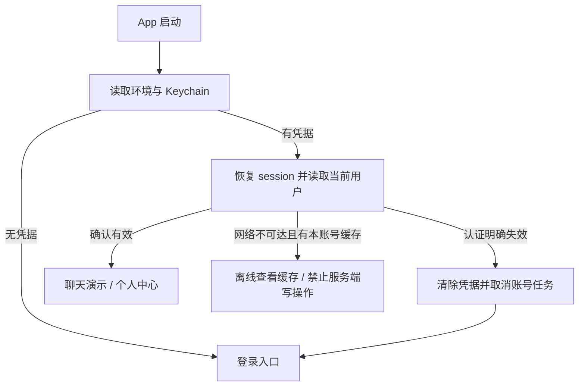

# iOS 认证与用户接口接入

> **状态：设计阶段，尚未接入应用。** 返回 [入口](README.md)。网络类型、字段和错误码以 [服务端协议](../../../AzureFishServer/Documentation/protobuf-contract.md) 为准，本文件不维护另一套接口定义。

## 1. 模块职责

| 组件 | 未来职责 |
| --- | --- |
| APIEnvironment | base URL、environment_id、Debug 本地配置；切换环境先退出当前会话 |
| ProtobufAPIClient | URLSession、Content-Type／Accept、大小限制、编码／解码、HTTP 错误映射 |
| AuthService | 注册、密码／Apple 登录、绑定、最近确认、退出及删除流程 |
| SessionCoordinator | session 单次刷新、Keychain 原子替换、认证状态及账号 generation |
| CredentialStore | 使用 Keychain 保存安装 ID 和完整认证包，不使用 UserDefaults 保存 token |
| UserRepository | 当前资料、版本合并、账号作用域缓存及头像获取 |
| AuthenticationCoordinator | 启动和 root 切换，主线程 UI 路由，保存可恢复输入状态 |

网络消息生成类型只在网络边界使用，转换成 Sendable 领域值；ViewController 不直接持有 Protobuf 对象或自行拼路由。密码、Apple 授权码和 proof 尽量只在短期流程内存持有，不进入日志、崩溃面包屑或本地 IM payload。

## 2. 协议产物与请求

未来的 Protos 源只在 AzureFishServer 维护。生成 Swift 文件同步到 AzureFish 自己的 Generated/Protocol 源目录，随客户端版本保存协议 revision、schema hash 和生成器／运行库版本记录。第三方 SwiftProtobuf 使用远程 Package；不通过相邻目录的本地 Package 引用让 App 构建隐式依赖服务端工程。

真实业务通过 HTTPS，Debug 回环 HTTP 仅限独立环境中的虚构测试数据；Protobuf 不提供加密。请求体是 Protobuf 二进制，普通 API 的 Content-Type 和 Accept 为 application/protobuf；GET 没有 body。资料响应解码为 UserProfile，业务错误先按 HTTP 状态识别，再尝试解码 ApiError。头像成功是 image/jpeg 或带缓存的 304；其错误仍是 ApiError。代理 HTML 错误、错误 MIME 或截断数据映射成可识别网络错误，不当作密码错误。

普通请求超时默认 15 秒，头像上传资源超时 60 秒；任务支持取消。GET 可对临时网络失败自动重试一次；写请求仅在结果不确定时使用原 operation_id 和相同序列化字节重试一次，不能为每次重试新建 operation_id。用户主动修改内容后重新提交必须使用新 ID。

X-Request-ID 每次网络调用不同，operation_id 保持一个业务动作不变。保存密码请求的重试字节只存在内存，不写入磁盘。并发重复点击提交按钮由页面工作状态防止，服务器仍做幂等，不能把 UI 防抖当作唯一约束。

## 3. 认证包与刷新

Keychain 的认证包包含 environment_id、user_id、device_id、session_id、access_token／截止、refresh_token／绝对截止、refresh_generation、pending refresh operation_id。登录包与数据库／媒体密钥项分开，普通退出不删除存储密钥，具体用途见 [安全设计](../Security/README.md)。使用一个 Keychain item 原子替换整个包，访问等级采用 AfterFirstUnlockThisDeviceOnly，不同步到其他设备。安装 ID 使用另一个 ThisDeviceOnly 项，重装或清理后的行为按实际 Keychain 环境验证，不将其当设备硬件身份。

每个 session 仅允许一个活跃刷新任务，其他请求等待同一个结果。刷新开始前把 operation_id 与当前 generation 写回认证包；成功后原子保存新包并清空 pending。响应丢失、App 被杀或重启时仍复用该 operation_id 与旧 refresh，服务器可在恢复窗口返回原结果。

普通受保护请求收到 401 UNAUTHENTICATED 时先核对请求发出时与当前 generation：若其他请求已刷新，改用当前 token 重试一次；若没有则执行单次共享刷新。刷新本身收到认证失败直接终止，不能递归调用刷新。旧代回包、REFRESH_SUPERSEDED 或旧账号回包不能覆盖更高代次／当前账号凭据。

访问有效期 15 分钟，刷新绝对期限 30 天；本地时间只用于提前准备，服务器是权威。网络不可达时保留认证包和已确认账号缓存，不把临时离线当作凭据被撤销；明确 UNAUTHENTICATED／REFRESH_REPLAY 或账号停用时清除凭据并回登录。

## 4. 启动与账号切换

恢复时显示中性的系统加载页，不先闪现另一账号的聊天或资料。没有本账号资料缓存且网络不可达时留在可重试恢复页，不展示伪造用户。离线模式只允许查看已归属该账号的内容，不假装保存资料或完成绑定；显示离线状态。

成功 AuthResponse 的 environment_id 必须匹配选定环境，服务端 user_id 是唯一账号键。每次登录、退出或环境切换分配新 generation；网络、头像、观察和异步 UI 回包均校验 generation。退出先失效旧 generation，取消任务、断开观察、清除当前认证包，再切 root。

已有 local-demo 草稿继续留在演示命名空间，不能因第一次登录把它们归给真实用户。真实账号本地数据库未来按 environment_id＋user_id 打开，auth token 仍只在 Keychain。首次登录接入不等于本轮实现全部 GRDB 表；登录阶段所需资料缓存采用独立账号范围的 AES-GCM 小型快照，禁止明文 JSON／UserDefaults 过渡，后续可由 UserRepository 迁入 GRDB。

## 5. Apple 与敏感动作

使用系统 ASAuthorizationAppleIDButton 和 AuthenticationServices。先从服务器取匹配 purpose 的挑战，把 nonce 原样赋给系统请求；系统返回后提交 code、identity_token 和挑战 ID。用户取消属于正常返回登录页，不显示红色认证错误。

登录用 LOGIN；已登录绑定用 BIND 且绑定当前 session；敏感动作先用现有方式获取指定 action 的 reauth_token，5 分钟内提交该动作。解绑 Apple 要求用保留的密码确认，Apple-only 用户先设置密码；不能拿刚刷新的 access token 代替最近确认。

首次 Apple 姓名是可选显示输入，缺失时进入资料完善；后续缺失不清空昵称。已绑定其他账号的 Apple 身份显示冲突，提供取消／切换账号选择，不暗中迁移数据。系统 credentialState 变 revoked 时更新状态并使相关会话重新确认；真正服务端鉴权仍不能依赖客户端单方报告。

业务重试保持原 operation_id 和请求字节，更新 Bearer 后仍由服务器按同一 user＋session 去重。OPERATION_RESULT_EXPIRED 表示结果缓存已清理，先读取当前状态对账，不自动新建操作；AUTH_ATTEMPT_EXPIRED 需重新完成相应认证。只有 UNAUTHENTICATED 可触发通用刷新；INVALID_CREDENTIALS、REAUTH_REQUIRED、CHALLENGE_INVALID 等业务 401 按各自流程处理。

若当前 session 来自 Apple，解绑 Apple 成功也会退出当前登录，随后用剩余密码登录；密码来源 session 可以继续。密码修改成功撤销所有会话，包括当前；客户端清除 Keychain 后提示重新登录。设置密码成功不强制退出，随后刷新身份列表和 /me 以取得 account_name 及资料版本。

## 6. 用户资料、头像与退出

UserRepository 只接收当前 environment＋user_id 且 profile_version 不低于本地值的响应。编辑保存只提交有 presence 的改变字段；409 时保留输入并重新读取，显示可理解冲突，不自动覆盖远端新资料。

头像选择通过系统相册选择器，局部使用系统集成布局；裁剪／输出 JPEG 后用 UploadAvatarRequest 上传。禁用 URLCache／图片框架的明文磁盘缓存，仅使用账号级 AES-GCM 受控缓存；缓存键包含环境、账号和 asset_id，退出账号解除内存图像引用，不能仅按固定 /me/avatar URL 复用另一用户图片。照片访问拒绝、取消和图像不支持分别显示，不影响文字编辑。

用户主动退出时先尝试服务器 logout；网络不可达仍允许本机退出并清除可访问凭据，但不能声称服务器已撤销。为补偿，仅将原 logout 请求字节和原访问 token 存入独立、不可用于普通请求的 Keychain 撤销队列，限定到 access 原截止；后台恢复连通时提交原请求，成功或到期即删除。普通 SessionCoordinator 不读取该队列恢复登录，队列不保留 refresh token。用户删除 App 或清除 Keychain 后无法保证补偿执行，服务器仍按绝对期限终止会话。

退出全部设备和删除账号需要服务器确认，离线时不能报告成功。删除返回 202 表示账号已停用且服务端删除恢复日志已确认，清除本机该账号凭据、资料缓存，并将本地历史／备份／媒体及最后的存储密钥清理交给账号存储；只有服务器已确认后才执行破坏性清理。UI 明示外部清理可能仍在进行，不将 logout 与删除合并成同一按钮。

## 7. 系统与调试边界

界面尺寸转换与语言切换复用同一业务协调器，不重建 session、operation_id 或页面输入；新规范见 [多设备 UI](../Design/README.md) 与 [四语言国际化](../Internationalization/README.md)。系统 Apple／相册界面遵循系统本地化，不能承诺跟随应用内语言。

存储／认证领域与网络层支持 iOS 15，不引用 iOS 26-only 聊天 UI 类型。后续正常启动 root 由 AuthenticationCoordinator 管理；Debug 的 -chat-ui-test-root 继续进入隔离演示，不发送真实注册请求。认证 UI 测试使用可注入 AuthService 与固定数据，不能在 Release 留下跳过鉴权路径。

真实服务器地址仅在 Debug 配置页面显示；用户产品流程不展示 protobuf 类型、token、数据库错误或内部路由。诊断日志保留 request_id、HTTP／业务 code、耗时，不保留正文凭据。
