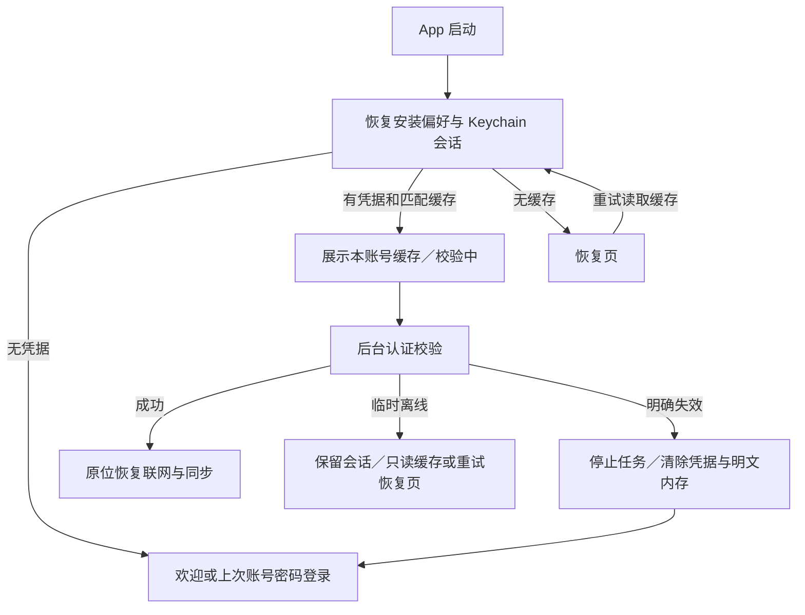

# iOS 认证与用户接口接入

> **状态：密码认证、Keychain 会话、加密缓存与默认自动登录已接入 App，仅供本机虚构账号验证。** 当前行为和证据见[自动登录实施记录](Implementation/2026-09-29-auto-login.md)。返回 [入口](README.md)。网络类型、字段和错误码以 [服务端协议](../../AzureFishServer/Documentation/protobuf-contract.md) 为准。Apple 相关内容仍为后续设计，不属于本次实现。

## 1. 模块职责

| 组件 | 职责与实施状态 |
| --- | --- |
| APIEnvironment | 已在 AzureFishAPI 实现 base URL、environment_id、Debug 回环限制；切换环境的退出编排待 App 实现 |
| HTTPClient／AccountAPI | 已分包实现 URLSession、Content-Type／Accept、大小限制、Protobuf 编解码、HTTP 错误映射及首期账号调用 |
| LiveAccountService | App 层复用 AccountAPI 的密码认证服务；Apple 认证未开放 |
| SessionCoordinator | session 单次刷新、Keychain 原子替换、认证状态及账号 generation |
| CredentialStore | 使用 Keychain 保存安装 ID 和完整认证包，不使用 UserDefaults 保存 token |
| UserRepository | 当前资料、版本合并、账号作用域缓存及头像获取 |
| AccountRootViewController | 启动和 root 切换、主线程 UI 路由；认证校验原位更新能力，不重建导航 |

网络消息生成类型只在网络边界使用，转换成 Sendable 领域值；ViewController 不直接持有 Protobuf 对象或自行拼路由。密码、Apple 授权码和 proof 尽量只在短期流程内存持有，不进入日志、崩溃面包屑或本地 IM payload。

## 2. 协议产物与请求

Protos 源只在 AzureFishServer 的 `Protos/azurefish.proto` 维护，首期已定义密码账号接口；生成清单 `Protos/generation.json` 记录 schema hash 与生成器／运行库版本。客户端将带注释的 proto 副本同步到 `SharePackage/AzureFishProtocol/Sources/AzureFishProtocol/azurefish.proto`，由官方 SwiftProtobufPlugin 在构建时生成 Swift，随客户端保存 `generation.json` 的来源和内容 hash；服务端协议来源文件尚未提交或存在未提交修改时 revision 明确为空。第三方 SwiftProtobuf 使用精确锁定的远程 Package；不将服务端 Package 作为 App 构建依赖，正常构建通过插件调用锁定依赖自带的 protoc 和 Swift 生成器，无需手工安装工具。

首期接入范围为 `/v1/auth/register`、`/v1/auth/login`、`/v1/auth/refresh`、`/v1/auth/logout` 和 `/v1/me`（GET／PATCH）；成功写动作的恢复窗口为 10 分钟。后续头像及账号安全入口的实施状态见[闭环记录](Implementation/2026-09-28-app-closure.md)，不能再按首期未实现范围判断。2026-09-29 的头像共享、资料更新失效及长期密文保留规则见[通讯录缓存](../Design/Chat/contact-cache.md)。真实账号验收门槛仍以验证记录为准。

真实业务通过 HTTPS，Debug 回环 HTTP 仅限独立环境中的虚构测试数据；Protobuf 不提供加密。请求体是 Protobuf 二进制，普通 API 的 Content-Type 和 Accept 为 application/protobuf；GET 没有 body。资料响应解码为 UserProfile，业务错误先按 HTTP 状态识别，再尝试解码 ApiError。头像读取使用携带 JPEG 字节与资源 ID 的 `AvatarResponse`，Content-Type 同为 `application/protobuf`，错误仍为 ApiError。禁止 URLCache 磁盘缓存。代理 HTML 错误、错误 MIME 或截断数据映射成可识别网络错误，不当作密码错误。

当前普通请求不活动超时默认 15 秒，URLSession 资源总时限为 60 秒；未来头像上传资源时限同为 60 秒，当前头像上传已接入，大小限制见服务端账号安全契约。任务支持取消。GET 可对临时网络失败自动重试一次；写请求仅在超时／连接中断时使用原 operation_id 和相同序列化字节重试一次，不能为每次重试新建 operation_id。用户主动修改内容后重新提交必须使用新 ID。业务 HTTP 错误、证书错误和解码错误不自动重试。

X-Request-ID 每次网络调用不同，operation_id 保持一个业务动作不变。保存密码请求的重试字节只存在内存，不写入磁盘。并发重复点击提交按钮由页面工作状态防止，服务器仍做幂等，不能把 UI 防抖当作唯一约束。

当前 AccountAPI 采用 prepare／execute：prepare 序列化为不可变 AccountOperation，execute 可为受保护操作注入同一 session 的较新 Bearer。包验证操作绑定的环境、账号、session 和最低刷新代次；App 的账号 generation 由 SessionCoordinator 管理，并发刷新与凭据持久化顺序由共享 APISessionManager 管理。

## 3. 认证包与刷新

Keychain 的认证包包含 environment_id、user_id、device_id、session_id、access_token／截止、refresh_token／当前截止、refresh_generation、pending refresh operation_id。登录包与数据库／媒体密钥项分开，普通退出不删除存储密钥，具体用途见 [安全设计](../Security/README.md)。使用一个 Keychain item 原子替换整个包，访问等级采用 AfterFirstUnlockThisDeviceOnly，不同步到其他设备。安装 ID 使用另一个 ThisDeviceOnly 项，重装或清理后的行为按实际 Keychain 环境验证，不将其当设备硬件身份。

每个 session 仅允许一个活跃刷新任务，其他请求等待同一个结果。刷新开始前把 operation_id 与当前 generation 写回认证包；成功后原子保存新包并清空 pending。响应丢失、App 被杀或重启时仍复用该 operation_id 与旧 refresh，服务器可在恢复窗口返回原结果。

普通受保护请求收到 401 UNAUTHENTICATED 时先核对请求发出时与当前 generation：若其他请求已刷新，改用当前 token 重试一次；若没有则执行单次共享刷新。刷新本身收到认证失败直接终止，不能递归调用刷新。旧代回包、REFRESH_SUPERSEDED 或旧账号回包不能覆盖更高代次／当前账号凭据。

访问有效期 15 分钟；登录和成功刷新后续期 30 天，相同操作重试返回原截止且不重复延期；本地时间只用于提前准备，服务器是权威。网络不可达时保留认证包和已确认账号缓存，不把临时离线当作凭据被撤销；明确 UNAUTHENTICATED／REFRESH_REPLAY 或账号停用时清除凭据并回登录。

## 4. 启动与账号切换

```mermaid
flowchart TD
    START[App 启动] --> READ[恢复安装偏好与 Keychain 会话]
    READ -->|无凭据| LOGIN[欢迎或上次账号密码登录]
    READ -->|有凭据和匹配缓存| LOCAL[展示本账号缓存／校验中]
    READ -->|无缓存| WAIT[恢复页]
    LOCAL --> CHECK[后台认证校验]
    WAIT -->|重试读取缓存| READ
    CHECK -->|成功| HOME[原位恢复联网与同步]
    CHECK -->|临时离线| OFFLINE[保留会话／只读缓存或重试恢复页]
    CHECK -->|明确失效| CLEAR[停止任务／清除凭据与明文内存]
    CLEAR --> LOGIN
```

同一环境的窗口通过共享 SessionCoordinator 使用同一个 APISessionManager。`restoreLocal()` 只读取本地身份与未决刷新，不请求网络；`validateSession()` 恢复刷新并向服务器确认身份。校验中和离线时关闭业务凭据访问，缓存与草稿可用；HTTP、实时连接、发送和传输队列在确认成功后恢复。未发送的编辑内容不会自动提交。

业务调用在首次发送、认证重试和实际传输任务开始时检查会话代次、取消状态与业务权限。关闭业务网络不会取消共享刷新，但刷新完成后仍禁止等待者发送业务请求，以 `verificationRequired` 结束；显式会话校验保留执行能力。重新开放后仅新调用可继续执行。

启动及再次进入前台校验会话；前台 access 到期时触发共享刷新。后台不为续期运行保活计时器。网络恢复、下拉刷新或恢复页重试可触发恢复，并合并并发触发。本地时钟只触发服务器验证，不凭本地到期判断清除会话。无本账号缓存时显示中性恢复页，联网也不静默创建空库；密钥缺失、错误或缓存损坏不覆盖原数据。只有密码认证成功后可初始化新账号业务库，多窗口等待首次文件初始化后再分别打开连接。

上次成功账号保存在独立的环境隔离 Keychain 项 `remembered-login.<environment>`，只包含环境、用户 ID、账号名；不可授权读取业务数据。普通退出、改密与全设备退出保留提示；删除账号或明确清理该账号全部本地数据须移除。提示读写失败不改变认证结果，读取失败使用通用登录入口。

成功 AuthResponse 的 environment_id 必须匹配选定环境，服务端 user_id 是唯一账号键。每次登录、退出或环境切换分配新 generation；网络、头像、观察和异步 UI 回包均校验 generation。退出先失效旧 generation，取消任务、断开观察、清除当前认证包，再切 root。

已有 local-demo 草稿继续留在演示命名空间，不能因第一次登录把它们归给真实用户。当前虚构账号聊天数据库按 environment_id＋user_id 打开 SQLCipher 存储，auth token 仍只在 Keychain。登录阶段所需资料缓存采用独立账号范围的 AES-GCM 小型快照，禁止明文 JSON／UserDefaults 过渡；真实账号开放仍需完成安全验收。

## 5. Apple 与敏感动作

使用系统 ASAuthorizationAppleIDButton 和 AuthenticationServices。先从服务器取匹配 purpose 的挑战，把 nonce 原样赋给系统请求；系统返回后提交 code、identity_token 和挑战 ID。用户取消属于正常返回登录页，不显示红色认证错误。

登录用 LOGIN；已登录绑定用 BIND 且绑定当前 session；敏感动作先用现有方式获取指定 action 的 reauth_token，5 分钟内提交该动作。解绑 Apple 要求用保留的密码确认，Apple-only 用户先设置密码；不能拿刚刷新的 access token 代替最近确认。

首次 Apple 姓名是可选显示输入，缺失时进入资料完善；后续缺失不清空昵称。已绑定其他账号的 Apple 身份显示冲突，提供取消／切换账号选择，不暗中迁移数据。系统 credentialState 变 revoked 时更新状态并使相关会话重新确认；真正服务端鉴权仍不能依赖客户端单方报告。

业务重试保持原 operation_id 和请求字节，更新 Bearer 后仍由服务器按同一 user＋session 去重。OPERATION_RESULT_EXPIRED 表示结果缓存已清理，先读取当前状态对账，不自动新建操作；AUTH_ATTEMPT_EXPIRED 需重新完成相应认证。只有 UNAUTHENTICATED 可触发通用刷新；INVALID_CREDENTIALS、REAUTH_REQUIRED、CHALLENGE_INVALID 等业务 401 按各自流程处理。

若当前 session 来自 Apple，解绑 Apple 成功也会退出当前登录，随后用剩余密码登录；密码来源 session 可以继续。密码修改成功撤销所有会话，包括当前；客户端清除 Keychain 后提示重新登录。设置密码成功不强制退出，随后刷新身份列表和 /me 以取得 account_name 及资料版本。

## 6. 用户资料、头像与退出

UserRepository 只接收当前 environment＋user_id 且 profile_version 不低于本地值的响应。编辑保存只提交有 presence 的改变字段；409 时保留输入并重新读取，显示可理解冲突，不自动覆盖远端新资料。

头像选择通过系统相册选择器，局部使用系统集成布局；裁剪／输出 JPEG 后用 UploadAvatarRequest 上传。禁用 URLCache／图片框架的明文磁盘缓存，仅使用账号级 AES-GCM 受控缓存；缓存键包含环境、账号和 asset_id，退出账号解除内存图像引用，不能仅按固定 /me/avatar URL 复用另一用户图片。照片访问拒绝、取消和图像不支持分别显示，不影响文字编辑。

用户主动退出时先尝试服务器 logout；网络不可达仍允许本机退出并清除可访问凭据，但不能声称服务器已撤销。为补偿，仅将原 logout 请求字节和原访问 token 存入独立、不可用于普通请求的 Keychain 撤销队列，限定到 access 原截止；后台恢复连通时提交原请求，成功或到期即删除。普通 SessionCoordinator 不读取该队列恢复登录，队列不保留 refresh token。用户删除 App 或清除 Keychain 后无法保证补偿执行，服务器仍按最后一次成功刷新的截止终止未继续续期的会话。

服务器退出结果不确定时，关闭提示仍保留当前页面、导航、未提交草稿与凭据，连接状态转为离线只读，暂停实时连接和联网队列。重新连接必须重新加载本地会话并向服务器校验；有效才原位解锁，确认撤销则清除凭据并回登录入口，持续离线仍只读，存储读取失败进入现有恢复页并保留原数据。个人中心的重新加载入口在只读期间走同一恢复流程，编辑页仅更新提交能力，不覆盖输入。

重复退出沿用原 operation_id，由 APISessionManager 的退出流程处理认证刷新，不对仍处于 endingSession 的管理器预刷新。每次退出／本机退出从当前凭据重建撤销材料，避免复用刷新前 Bearer；队列保存的是这次构造的请求与访问凭据。普通退出不删除加密业务数据及存储密钥。本次变更与验证见[网络恢复修复记录](Implementation/2026-09-30-network-recovery.md)。

退出全部设备和删除账号需要服务器确认，离线时不能报告成功。删除返回 202 表示账号已停用且服务端删除恢复日志已确认，清除本机该账号凭据、资料缓存，并将本地历史／备份／媒体及最后的存储密钥清理交给账号存储；只有服务器已确认后才执行破坏性清理。UI 明示外部清理可能仍在进行，不将 logout 与删除合并成同一按钮。

## 7. 系统与调试边界

界面尺寸转换与语言切换复用同一业务协调器，不重建 session、operation_id 或页面输入；新规范见 [多设备 UI](../Design/README.md) 与 [四语言国际化](../Internationalization/README.md)。系统 Apple／相册界面遵循系统本地化，不能承诺跟随应用内语言。

存储／认证领域与网络层支持 iOS 15，不引用 iOS 26-only 聊天 UI 类型。当前正常启动 root 由 AccountRootViewController 管理；Debug 的 -chat-ui-test-root 继续进入隔离演示，不发送真实注册请求。认证 UI 测试使用可注入服务与固定数据，不能在 Release 留下跳过鉴权路径。

真实服务器地址仅在 Debug 配置页面显示；用户产品流程不展示 protobuf 类型、token、数据库错误或内部路由。诊断日志保留 request_id、HTTP／业务 code、耗时，不保留正文凭据。
