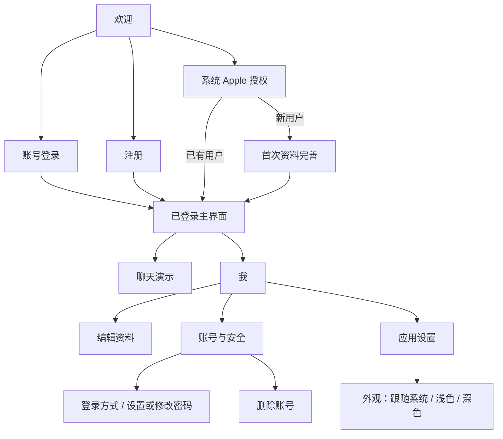

# 苹果风格登录与个人中心 UI／UX

> **状态：设计阶段，尚未接入应用。** 本文是页面与交互规格，没有创建 View 或改动现有聊天。返回 [入口](README.md)。

尺寸规则以 [多设备规范](../Design/README.md) 为准，四语言资源与切换以 [国际化规范](../Internationalization/README.md) 为准；以下细化首期页面，不另定义断点。

主题偏好与视觉状态同样以多设备规范为准：默认跟随系统，可手动选择浅色／深色；欢迎页外观菜单与“我 → 应用设置 → 外观”共享本机偏好。当前项显示勾选，切换即时生效并保留当前页面及业务状态。

## 1. 视觉及布局原则

采用 UIKit＋QuickLayoutKit，页面使用 QuickLayoutHostingController／QuickLayoutView 描述内容，列表复用原生分组体验与项目 ListKit 能力。系统 Apple 登录按钮、相册、键盘及权限弹窗保持系统控件，不绘制仿制弹窗。独立 View／Controller 的 #Preview 在同一文件 DEBUG 区域，按实际可用版本标注。

系统背景、secondarySystemGroupedBackground、label／secondaryLabel、tintColor 和系统字体构成基础视觉。**iOS／iPadOS 26 及以上使用系统 Liquid Glass（液态玻璃）；iOS／iPadOS 15～25 使用非液态玻璃外观**，沿用对应系统的原生控件，不仿制 Liquid Glass。iPhone Duo 在 iOS 27.1 及以上延续液态玻璃体系并补充设备适配。交互目标至少 44×44 pt，文本内容自然增高；登录内容在 iPad 采用居中且最大宽度 440 pt 的表单，iPhone 两侧安全间距 20 pt，窄窗口按实际宽度收缩。

登录、个人中心和账号安全共享业务状态及布局规则，外观变化不重建输入或导航。Liquid Glass 专用 API 通过准确 availability 隔离，不进入旧系统路径；遵循系统“降低透明度”“增强对比度”等辅助功能设置，不为保持玻璃效果牺牲可读性。

不使用大幅营销插画或填满页面的渐变，主操作清楚、次操作克制。系统安全确认用 destructive 样式，普通错误使用字段下方或表单反馈，不用每次失败都弹阻塞警告。

## 2. 导航结构

代码阶段已登录主界面采用原生 UITabBarController：“聊天”“我”。聊天沿用导航容器；“我”使用自适应系统导航，regular 且可用宽度至少 840 pt 时双列，否则单列 push，共享同一选择与详情状态。聊天 tab 保留当前 iOS 26+ ChatViewController，旧系统仍是现有兼容入口；显示适度的“本地演示”说明，不将模拟回复表现为其他真实注册用户发来的消息。此次认证设计不新增会话列表或好友入口。

## 3. 页面规格

| 页面 | 内容与操作 | 成功去向 | 失败与恢复 |
| --- | --- | --- | --- |
| 欢迎 | AzureFish 名称、简短说明、主按钮“使用账号登录”、次操作“注册账号”、系统 Apple 按钮、外观菜单 | 密码表单或系统授权；选主题留在当前页 | Apple 用户取消留在本页；不可达提示重试；主题选择不依赖网络 |
| 账号登录 | 账号、密码、安全显示切换、“登录”；账号输入关闭自动纠正与首字母大写 | 进入主界面 | 保留账号，不回显服务端敏感原因；失败后可编辑；不出现无实现的找回链接 |
| 注册 | 账号、昵称、密码、确认密码；密码规则就地说明 | 自动登录进入“我” | 字段校验对应字段；账号占用保留其他输入；确认密码只在客户端比较，不上传 |
| Apple 资料完善 | 默认／首次昵称、头像、可选简介，“完成”“稍后” | 主界面 | 保存失败保留输入；“稍后”保留 needs_profile_completion，之后个人中心可继续 |
| 我 | 头像、昵称、可选账号名、简介；编辑资料、账号与安全、应用设置、退出登录 | 对应页面 | 无头像显示系统默认；离线展示账号缓存并说明不可保存；本机外观设置仍可修改 |
| 应用设置／外观 | 分组列表提供“跟随系统、浅色、深色”，当前项勾选；语言为独立设置项 | 立即更新当前与其他应用窗口，留在本页 | 缺失或无效偏好按跟随系统处理；不清空表单、退出账号或请求服务器 |
| 编辑资料 | 昵称、简介、头像入口；导航“取消”“完成” | 成功返回并刷新资料 | 版本冲突保留草稿，提供重新载入或按最新版本重新确认保存 |
| 账号与安全 | 登录方式、密码操作、退出全部设备、删除账号 | 对应确认流程 | 状态按服务端身份列表展示；没有密码则显示“设置密码” |
| 登录方式 | PASSWORD 账号只读；Apple 显示未绑定／已绑定／处理中／授权失效 | 绑定后刷新 | 不展示 Apple sub 或隐私邮箱；冲突说明无法直接合并账号 |
| 密码设置／修改 | 最近身份确认后填写新密码和确认密码 | 设置成功留在安全页；修改成功要求重新登录 | 规则错误就地显示；proof 到期重新确认，不丢弃新密码内存输入 |
| 删除账号 | 明确说明账号和资料会被清除；最近身份确认；最终红色删除操作 | 服务器接受后退出到欢迎 | 离线不提交成功；服务失败可取消返回；202 文案为“删除申请已受理” |

所有用户文案进入简体中文、繁体中文、英文、阿拉伯语 String Catalog。表中中文是语义文案基线，网络错误 code 在客户端映射，不直接展示英文内部字段。

## 4. 输入、头像与提交

以下矩阵补充每页在不同窗口的行为。全页共用规则：加载保持外框、离线／超时保留输入、字段错误就地提示、辅助功能字体可滚动；VoiceOver 标题与错误关联完整，RTL 按 leading/trailing 排列。错误状态也必须覆盖表中尺寸，不能只验空表单。

| 页面 | 窄屏／宽屏 | 键盘、焦点与连续性 | 大字体、VoiceOver 与 RTL 专项 |
| --- | --- | --- | --- |
| 欢迎／语言选择 | 窄屏纵向按钮；宽屏居中 440 pt；语言系统菜单锚定按钮 | Apple 取消回原按钮；尺寸变化不再次发起授权 | 系统 Apple 按钮合规尺寸，四语言名称自称；朗读操作目的 |
| 账号登录 | 单列表单，宽屏仍 440 pt | 账号→密码→登录；超时保留账号和短期内存密码；回包绑定原 operation | 用户名独立输入方向，显示密码按钮有状态标签；错误后聚焦关联字段 |
| 注册 | 窄屏可滚动，宽屏居中表单 | 账号→昵称→密码→确认；键盘出现后能访问提交 | 规则说明不截断，确认密码不上传；四语言账号占用与长度提示 |
| 首次资料完善 | 单列头像及文字；宽屏居中，不为小表单增设空主列 | 姓名可编辑，图片上传独立；尺寸变化保留“稍后”与编辑内容 | 默认昵称／头像有说明；“稍后”可访问，不误读为已保存 |
| 我／概览 | 单列分组；符合断点时左列表＋右概览 | 当前选择按稳定 ID 保留；离线只读不清空资料 | 头像／昵称组成可理解摘要，未设置账号名不显示空按钮 |
| 昵称编辑 | 窄屏 push；宽屏详情内表单，最大 600 pt | 保存冲突不丢输入；焦点与选择范围随折叠恢复 | 字数规则与错误关联输入；大字体多行但不换成多行账号输入 |
| 简介编辑 | 窄屏可滚动；宽屏详情限宽 | 多行输入、键盘避让；空串表示清空；取消只取消文字草稿 | 阿拉伯文连写与混合 URL 不破坏数据；剩余数量使用复数资源 |
| 头像编辑 | 系统选择器＋正方形预览；iPad 弹层锚定触发头像 | 预览确认后独立上传；旋转／展开不重复上传 | “使用此头像”“恢复默认”可达，上传失败保留预览；图片不 RTL 镜像 |
| 登录方式／绑定 | 单列 push／宽屏详情 | 系统授权由流程协调器持有；冲突可取消；Apple 来源解绑会重新登录 | 已绑定／处理中／授权失效有文字说明，不仅颜色；不展示 sub |
| 密码管理／最近确认 | 窄屏滚动；宽屏敏感表单最大 440 pt | 自动填充、粘贴、焦点顺序；proof 到期重新确认但不写密码到磁盘 | 修改后全设备退出在提交前朗读说明，眼睛图标状态可辨 |
| 退出当前／全部 | 系统确认 sheet／popover，宽屏锚定实际按钮 | 取消返回原位置；离线只允许当前设备本机退出 | 区分本机退出和全设备退出，不用相同危险描述；焦点回发起项 |
| 删除账号 | 危险说明页＋系统最终确认；宽屏限宽，不拉满画布 | 最近确认后提交；离线不报成功；迟到响应校验账号 | VoiceOver 可读完整影响；红色之外有明确文字；202 用受理文案 |

语言入口在欢迎页和“我”的应用设置均可达；手动选择或跟随系统都不清除未提交表单。敏感数据不可用（锁定／缺钥／认证失败）显示独立可理解状态，不能显示成“空个人资料”并提交覆盖。

外观菜单在欢迎页锚定发起按钮；“我”的外观设置在窄屏 push、宽屏详情列展示。选项整行可点击，VoiceOver 朗读名称和选中状态；选中跟随系统时不可根据当前实际深浅色改变勾选。离线、登录前后及账号切换均使用同一安装偏好。

登录输入、资料编辑、头像上传和弹层展示过程中发生主题变化时，保持输入、焦点、导航、上传 operation 与请求次数不变。首个可见帧采用已恢复的主题；loading、错误、空状态、离线提示、禁用按钮与删除确认都采用当前主题语义颜色，不短暂显示浅色底板。默认头像／品牌资源可用主题变体，用户图片不得反色。

密码输入使用 secureTextEntry，登录密码采用 password content type，注册／新密码采用 newPassword；账号使用 username。支持密码自动填充，允许粘贴，不保存密码到 UserDefaults。显示密码按钮有明确 VoiceOver 标签，切换不改变光标和输入内容。回车按字段顺序移动焦点，最后字段触发合法提交。

主要按钮在请求期间显示系统进度、阻止重复提交；字段不能因 loading 改高度导致首帧跳动。取消页面会取消 UI 等待，但请求可能已被服务器接受，重新进入需读取权威资料，不凭取消动画推断业务回滚。

头像独立提交：选择照片 → 正方形预览 → “使用此头像”确认 → 上传并更新。头像区域说明“更新后立即生效”；文字“取消”不撤销已经确认的头像修改。删除头像使用原生菜单的“恢复默认头像”，先确认再调用接口。请求失败保留原头像和可重试预览，不能先永久替换为未保存图片。

相册选择器取消属于正常操作。无权限时说明如何打开系统设置，不引入任意文件系统路径输入。服务端拒绝格式时提示“请选择静态照片”，不展示解码器堆栈。

## 5. 绑定与敏感动作体验

绑定 Apple：先确认当前密码取得 BIND_APPLE 的 reauth_token → 获取 BIND 挑战 → 打开系统 Apple 授权 → 服务端绑定 → 显示已绑定。不能仅因系统弹窗成功就更新本地绑定状态。

Apple-only 用户设置账号密码：Apple 再确认 → 输入账号／新密码 → 保存 → 刷新账号名和方式列表。解绑 Apple 前必须已有密码，并用密码确认；处理中显示“正在解除关联”，不立即把状态画成未绑定。外部授权失效显示“重新授权”，不能隐藏成从未绑定。若当前 session 来自 Apple，解绑前说明成功后需使用密码重新登录；密码来源 session 可留在页面查看撤销进度。

退出当前设备使用确认 sheet，默认保留本机聊天记录；离线可本机退出但提示服务端状态待同步。退出全部设备与删除账号需要最近确认及真实服务器结果。修改密码导致所有设备退出的效果在提交前用简短说明告知，成功后导航到登录页。

## 6. 无障碍、语言与状态

| 维度 | 要求 |
| --- | --- |
| Dynamic Type | 表单和分组行自然增高；辅助功能字号下可滚动到全部字段和按钮 |
| VoiceOver | 标题层次、输入标签、密码可见性、错误关联清楚；提交成功／错误适度播报，不重复打断 |
| RTL | 行布局采用 leading/trailing；导航图标按系统镜像；账号／密码输入方向按其语义处理 |
| 深浅色 | 默认跟随系统，可选浅色／深色；使用系统语义颜色，不简单反色；选中、焦点、禁用与错误在两种模式均可辨 |
| 视觉辅助功能 | 分别验证“降低透明度”“增强对比度”及同时开启；沿用系统呈现，文字与操作保持可辨识 |
| 键盘 | 内容避让键盘与安全区；切换焦点不丢位置；外接键盘可顺序导航 |
| 离线／超时 | 保留用户输入和已有资料；区分服务器不可达与认证错误 |
| iPhone Duo | iOS 27.1 内外屏与展开／收起按当前窗口、safe area、reserved regions 更新；输入／焦点／上传状态不丢 |
| 国际化 | 四语言同一资源体系；可跟随系统，切换不清空编辑；中文简繁独立译文 |
| Session 过期 | 单次刷新期间不闪现欢迎页；明确失效才结束当前账号流程 |
| iOS 版本 | 认证、个人中心支持 iOS 15；26 以下非液态玻璃，26+ 系统 Liquid Glass，27.1+ Duo 另加设备适配；专用 API 分别检查 availability |

## 7. 预览和验收样例

代码阶段提供确定性样例：空登录、长账号、密码规则错误、注册进行中、Apple-only、双方式已绑定、头像失败、长昵称／简介、版本冲突、删除进行中、大字体和 RTL。预览不请求网络、不弹真实 Apple 授权，不生成正式用户。

每种页面状态同时检查浅色与深色；外观设置补充跟随系统／浅色／深色三种选中样例。系统自动切换、手动切换、重启和多窗口恢复必须在实际应用中验证，不能以固定主题的 #Preview 代替。

验收以首个可见帧及交互过程为准：启动不闪现旧账号、提交不跳动、取消系统授权返回原页面、数据库／网络回调不将用户突然导航到别的 tab。#Preview 与截图不替代模拟器和真机的登录、键盘、相册及 Keychain 验证。
