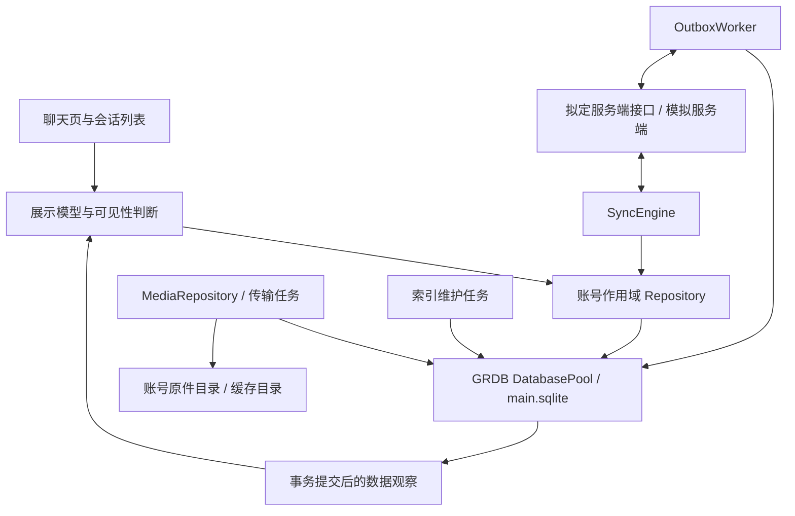
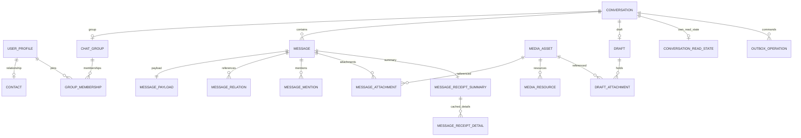
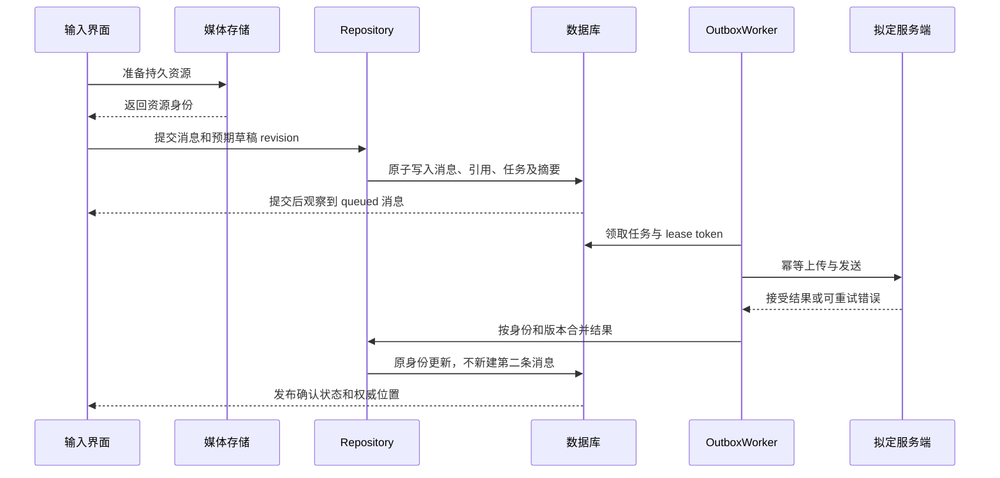
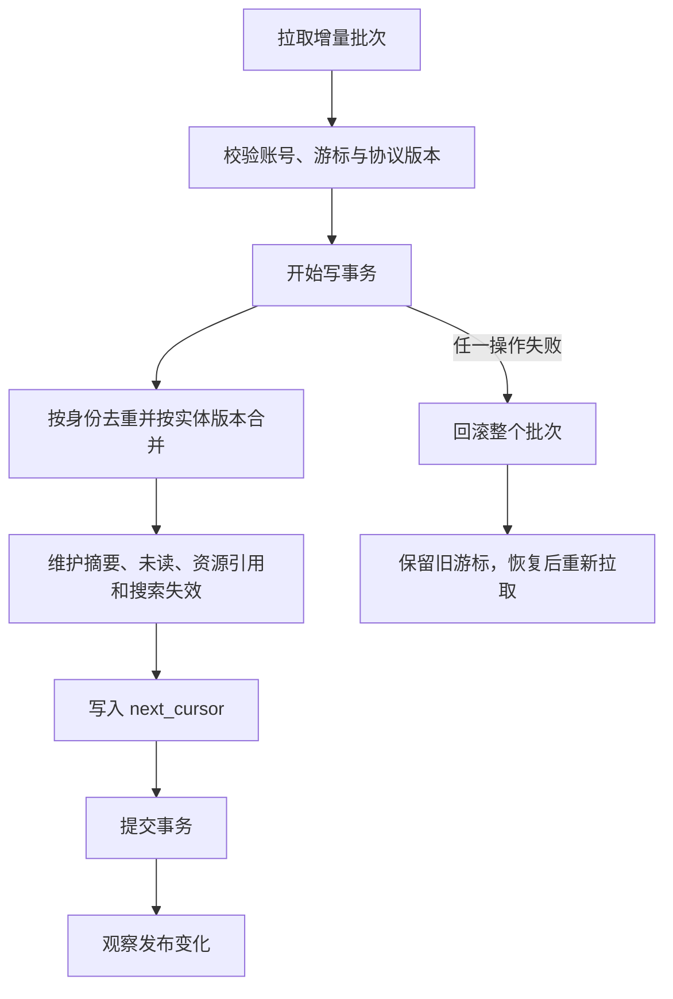

# 数据库整体架构与扩展设计

> **状态：设计阶段，尚未接入应用。** 本文规定开发目标，不代表已有实现。返回 [文档入口](README.md)。

## 1. 目标与边界

首期完整支撑私聊和 500 人以内群聊，以每账号百万条本地消息为容量验收基线。覆盖当前富文本、语音、媒体组、GIF、Live Photo、文件和链接，保留原始消息及附件身份。数据库设计支持 iOS 15，UI 继续使用现有版本路由；本次不设计旧系统聊天界面。

范围包括客户端持久化、服务端契约和模拟服务端验收要求。服务端部署、消息队列、群消息扩散实现、付费业务、跨设备备份及端到端加密不在首期范围内。服务端历史保留时长由接口返回边界表达，不在客户端硬编码天数。

本文“首期”指未来 IM 持久化阶段。当前先建设独立 [AzureFishServer](../../../AzureFishServer/README.md) 的认证与用户模块；客户端 [SessionCoordinator](../Authentication/client-integration.md) 提供已验证的环境、用户和设备身份。网络使用 HTTPS／WSS 的 Protobuf 二进制，Repository 通过显式映射转换为本地结构与 payload JSON，不能将本地表或 Codable 形状直接暴露为接口。网络消息定义归服务端协议文档，本地表定义仍归本目录。

## 2. 模块职责



| 层 | 负责 | 边界 |
| --- | --- | --- |
| AccountStore | 校验账号与环境、数据库打开关闭、依赖组装、会话代次 | 每账号一个实例；不使用进程全局无账号 Repository |
| Repository | 查询、领域约束、聚合事务、返回 Sendable 值快照 | 对 UI 隐藏 GRDB Record 和数据库连接 |
| SyncEngine | 增量批次、历史补拉、版本合并、游标恢复 | 网络结果必须经 Repository 入库，不直接插入 UI 数组 |
| OutboxWorker | 持久命令领取、重试、租约与幂等 | 不在数据库事务中等待网络 |
| MediaRepository | 持久资源所有权、文件校验、传输、租约及回收 | 页面只持有访问租约，不能删除已提交原件 |
| 搜索维护 | 生成可重建投影、失效去重、分词版本升级 | 不能作为正文或删除状态的权威来源 |
| ViewModel | 可见窗口、分页锚点、输入与交互状态 | 内存数组是显示快照，不是消息权威存储 |

对上层拟定的接口能力：`ConversationRepository` 提供会话观察和设置；`MessageRepository` 提供分页、观察、入队、重试、删除及撤回申请；`DraftRepository` 提供带 revision 的保存；`ReceiptRepository` 提供阅读推进及回执详情；`MediaRepository` 提供资源导入和租约。接口采用 `async throws`，观察以 `AsyncThrowingStream` 输出领域快照，底层由 GRDB `ValueObservation` 驱动。订阅取消必须释放观察，不得吞掉数据库错误。

数据库读写在 GRDB 调度环境执行；UI 变更回到 MainActor。任何事务闭包不得挂起、持有 UIKit 对象、调用网络或做大文件复制。账号切换时旧代次不能继续写入新账号库。

首期会话置顶、隐藏和前台免打扰偏好属于本设备设置，不同步到其他设备。服务端 APNs 推送静音需要后续通知设置接口，不能仅设置本地 is_muted 就宣称系统通知已静音；该后续能力应使用独立的设置命令和确认状态。

## 3. 物理布局与事务

每个环境与账号映射到一个不可逆目录键；账号和环境的真实身份在库内元数据校验，目录键本身不作为授权凭据。

```text
Application Support/IM/<account-storage-key>/
  main.sqlite
  main.sqlite-wal / main.sqlite-shm   （运行时生成）
  media/originals/
  staging/

Caches/IM/<account-storage-key>/
  thumbnails/
  downloads/
```

数据库采用 GRDB＋SQLCipher，媒体原件、持久缓存与加密 staging 使用独立 AES-GCM 密钥。数据库和密文文件继续使用 `completeUntilFirstUserAuthentication` 文件保护；重启首次解锁前暂停存储。密钥在账号隔离的 Keychain 中，先取钥再打开任何连接；普通 SQLite 导出不能作为加密备份。临时明文、备份排除及轮换见 [安全设计](../Security/README.md)。

加密依赖必须先验证 iOS 15、FTS、链接与迁移，配置失败不能自动回退明文库。每账号一个 `DatabasePool`，启用 WAL 和每连接外键，写入串行、读取使用连接池。首期以 `synchronous=FULL` 保证提交耐久性；降低同步等级必须另作测量与风险决策。连接池不提供跨文件事务，禁止首期把媒体元数据、会话摘要拆到另一个数据库。

| 业务操作 | 同一事务必须包含 | 事务外工作 |
| --- | --- | --- |
| 发送入队 | 消息、payload、资源引用、发送任务、摘要、草稿 revision 匹配后删除、搜索失效 | 复制媒体、上传、网络发送 |
| 收到同步批次 | 身份合并、实体版本、删除／撤回、摘要／未读、搜索失效、同步游标 | 解码及网络请求；复杂纯计算可提前准备 |
| 阅读推进 | 本机水位、未读投影、阅读上报任务 | 后台网络上报 |
| 删除或撤回落地 | tombstone、正文处理、引用快照处理、摘要、未读、资源引用、搜索失效 | 无引用资源物理清理 |
| 草稿保存 | 草稿新 revision、附件引用、旧引用释放 | 新资源准备 |
| 搜索更新 | 核对失效 generation、投影更新、FTS 触发维护、失效记录删除 | token 计算 |

首期 FTS 与业务同库。仅当实际测量证明必要，才将搜索拆为独立可重建库；届时通过持久索引任务实现最终一致，不能假设跨库原子提交。不会按会话建表、按年份提前分库或为每个消息类型建立独立数据库。

## 4. 实体关系



图表示领域关系；实际 FK、可空规则及 Repository 校验见 [字段字典](schema.md)。例如 payload 的一对一完整性在消息事务提交前验证，SQLite 普通外键本身不能强制每条父消息都有子 payload。

资料缺失时先创建占位用户和会话。会话占位仍必须使用服务端提供的真实类型、目标身份，禁止把未知群随意创建成私聊。被引用消息和先到撤回允许目标正文不存在，不以强外键迫使下载所有历史。

## 5. 消息内容与业务扩展

消息信封保存身份、发送者、会话、序号、版本和状态。payload 保存类型内容；媒体、@、引用及回执使用关系表。`direction` 由 sender 与当前账号比较得出，不作为另一份可漂移状态存储。UI 的字号、颜色、排版缓存与播放器状态不属于持久消息。

首期类型标识为 `text`、`rich_text`、`media_group`、`audio`、`file`、`link`、`system`。媒体组保留顺序，GIF 为 image 的元数据属性，Live Photo 为一个 asset 下的照片和配对视频。引用是一种关系，不单独替换正文消息类型。系统消息载荷使用事件代码和参数，由客户端本地化；真实用户文本不保存为资源键。

`content_type` 是开放字符串，不施加枚举 CHECK。`content_schema_version` 按类型递增，codec 对已知版本显式解码；未知类型/未来版本保留完整 payload 并显示占位。JSON 顶层是对象，不使用 Swift 自动枚举 Codable 的内部形状；结构合法性和大小上限由协议校验，基础 JSON 存储不依赖最新 SQLite JSON 函数。

| 后续业务 | 扩展方式 | 必须保持的约束 |
| --- | --- | --- |
| 收藏 | 独立收藏实体、内容快照、收藏资源引用 | 原消息删除后收藏仍成立；资源 GC 必须识别新增引用 |
| 表情 | 表情包、表情资源和使用偏好 | 不修改所有历史消息，仅新增内容类型和资源元数据 |
| 编辑 | 正文版本与按需编辑历史 | 消息身份、server_seq 不变；搜索、引用和翻译按版本失效 |
| 回应 | 消息／用户／回应类型关系 | 新增和取消采用服务端版本，禁止简单累加计数 |
| 置顶、公告 | 独立会话业务实体 | 由服务端鉴权和同步，不复用本机会话置顶字段 |
| 翻译 | 原消息、内容版本、目标语言和引擎版本缓存 | 正文改变或撤回立即失效 |
| 动态与社交内容 | 独立实体、Repository 与同步域 | 不把动态正文伪装成聊天消息 |

扩展时只在业务启动时新增表和迁移，首期不预建空壳业务表。高频筛选、排序和关联字段必须结构化；低频可选元数据才能放 JSON。后续新增同库业务先复用账号隔离与资源服务，不突破现有事务约束。

## 6. 关键流程





发送状态、回执、乱序以及历史补拉的详细规则见 [同步契约](sync-contract.md)。
