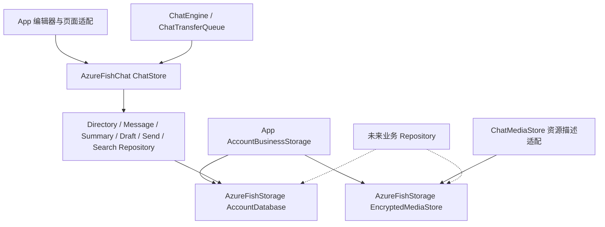

# 账号存储架构与扩展

当前代码架构；返回[入口](README.md)。

```mermaid
flowchart TD
    Owner[App AccountBusinessStorage] --> DB[AzureFishStorage AccountDatabase]
    Owner --> Files[AzureFishStorage EncryptedMediaStore]
    UI[App 编辑器与页面适配] --> Chat[AzureFishChat ChatStore]
    Engine[ChatEngine / ChatTransferQueue] --> Chat
    Chat --> Repos[Directory / Message / Summary / Draft / Send / Search Repository]
    Repos --> DB
    Media[ChatMediaStore 资源描述适配] --> Files
    Future[未来业务 Repository] -.-> DB
    Future -.-> Files
```

## 职责与所有权

- **AzureFishStorage** 只依赖 Foundation、CryptoKit 和固定的 SQLCipher GRDB。负责连接、账号身份、迁移账本、事务、加密文件、临时明文租约及跨业务资源引用检查，不依赖 UIKit、Protobuf 或聊天模型。
- **AccountBusinessStorage** 是 App 内账号资源所有者，按环境和账号复用打开任务、数据库与媒体实例。每个业务取得独立借用，最后一个借用释放后才清除租约并关闭数据库。每个窗口使用独立页面临时目录。
- **AzureFishChat** 使用 Record 映射和 Repository；ChatStore 是事务边界。接受 `AccountDatabase` 的初始化方式只借用连接，`close()` 不关闭账号数据库。独立测试用 URL 初始化由该实例拥有连接。
- **App 适配层** 在 ChatDraftSnapshot 与 StoredChatDraft 之间转换，页面 URL 转为加密资源 UUID。持久值类型没有 UIKit、页面文件路径或 Protobuf 依赖；网络 DTO 在业务 Repository 边界映射。

Record 集中声明表名、CodingKeys、Columns 与结构。业务不拼接表名，不用字符串取列、JSON 查询或 `.replace`。父实体采用 upsert／明确更新，子记录的替换和版本合并在同一事务内完成。普通状态回写只改状态，不能更换发送身份。

## 聚合事务

| 操作 | 同一数据库事务内 |
| --- | --- |
| 增量同步 | 各实体版本合并、消息内容与附件、摘要、撤回、FTS、下一检查点 |
| 入队 | 发送任务或上传批次、会话顺序、列表状态、消费草稿 |
| 上传完成 | 校验取消及稳定身份、转为发送任务、保留本机资源引用、移除上传批次 |
| 私聊解析 | 权威会话、旧临时草稿转移、解析记录；保留目标已有草稿 |
| 隐藏／清空／撤回 | 本机状态、内容或展示缓存失效、FTS 移除、可恢复资源清理请求 |

Repository 接收调用者的 `Database`，不会各自提交或等待网络。消息、摘要、草稿各按一页／一组批量读取子表，查询次数不随页内消息数线性增加。历史覆盖仅由已验证的历史响应写入，最新消息摘要不是历史缓存或覆盖证据。

## 内容与资源

消息稳定身份、服务端顺序和版本存于 `message`。正文按类型保存；未知类型与未来内容版本保留原始类型标识、版本及当前网络模型已接收的字段，使用未知内容记录，不默认解释成文本。当前网络模型未暴露的未来字段不能宣称已经完整保留。

消息附件引用版本化 `media_asset`；资源角色和次序存于 `media_asset_resource`，物理描述集中在 `media_resource`。多条消息、摘要和草稿可以共享资源。Live Photo 的原图与配对视频是同一逻辑附件下不同角色的资源。

草稿和展示缓存拆分根记录、片段、格式、附件、媒体组条目和波形记录；不同业务各有自己的引用表，不保存物理表名作关联。隐藏状态、临时私聊、未加载消息的缓存允许先于权威实体存在，因此不强加权威实体外键；已知聚合内部使用级联外键。

## 扩展方式

新业务建立自己的领域值、Record、Repository 和同步流，注入同一个账号数据库。账号组装层把未来迁移作为 `AccountMigration` 的有序列表通过 ChatStore.openDatabase 的 migrations 参数交给 AccountDatabase；已交付标识和实现不可改写。当前唯一基线由账号存储调用 ChatSchema 建立已有聊天领域。

账号打开时必须为所有已安装业务（包括尚未打开页面的业务）通过 `registerResourceReferences(domain:contains:)` 注册查询，使用传入的事务读取自身引用表；清理检查全部已注册业务。当前仅主应用进程拥有连接；App Extension／跨进程访问需要另行设计协调。

收藏、红包、动态等业务未接入，不预建实体；百万条消息容量、后台索引重建、资源自动淘汰和群回执成员明细也不是当前完成项。
