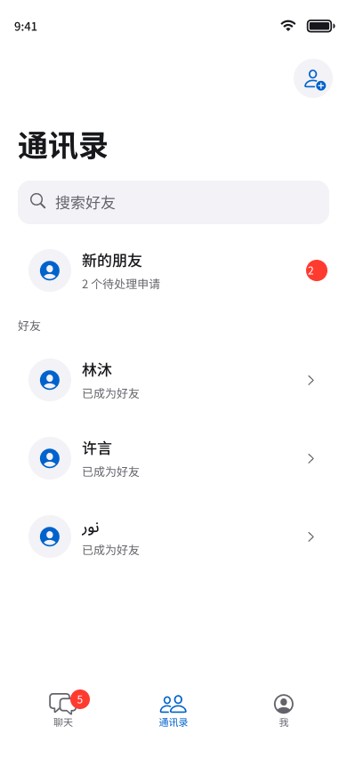
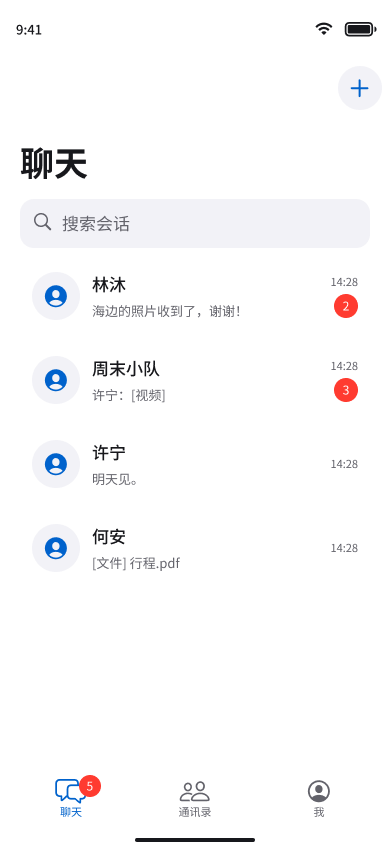
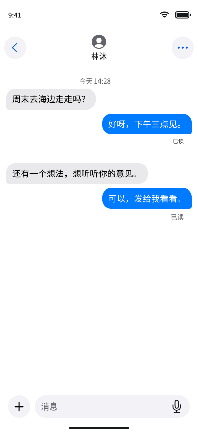

# 通讯录与真实聊天接入记录

本轮实施进行中。此文件区分设计图、代码与运行验收，尚未完成的项目不代表已验收。

## 工程内设计图

全部 33 张图片见 [离线画廊](Previews/index.html)，节点来源见 [导出清单](Previews/manifest.json)。聊天界面已按原工程更新，导航栏保留现有设计；细节见 [工程对照](engineering-alignment.md) 和 [撤回重新编辑](revoke-reedit.md)。

设计源为现有 [AzureFish Figma 文件](https://www.figma.com/design/su1BAcMKAwW11bE2n2n9rN/?node-id=83-1805)。PNG 是设计导出，不是模拟器运行截图。

| 页面 | 工程内设计图 | 可编辑源 |
| --- | --- | --- |
| 通讯录 | [PNG](Previews/contacts-list.png) | [Figma](https://www.figma.com/design/su1BAcMKAwW11bE2n2n9rN/?node-id=84-1805) |
| 新的朋友 | [PNG](Previews/friend-requests.png) | [Figma](https://www.figma.com/design/su1BAcMKAwW11bE2n2n9rN/?node-id=84-1861) |
| 好友申请 | [PNG](Previews/friend-request-detail.png) | [Figma](https://www.figma.com/design/su1BAcMKAwW11bE2n2n9rN/?node-id=84-1954) |
| 好友详情 | [PNG](Previews/friend-profile.png) | [Figma](https://www.figma.com/design/su1BAcMKAwW11bE2n2n9rN/?node-id=84-1974) |
| 删除确认 | [PNG](Previews/delete-friend.png) | [Figma](https://www.figma.com/design/su1BAcMKAwW11bE2n2n9rN/?node-id=84-1994) |
| 会话列表 | [PNG](Previews/conversation-list.png) | [Figma](https://www.figma.com/design/su1BAcMKAwW11bE2n2n9rN/?node-id=53-1805) |
| 私聊 | [PNG](Previews/private-chat.png) | [Figma](https://www.figma.com/design/su1BAcMKAwW11bE2n2n9rN/?node-id=53-2285) |

## 关系和同步

双方确认后建立好友关系。删除会双方解除关系，保留历史及历史媒体权限。私聊新发送、私聊媒体创建、建群和加人由后台检查好友关系；已有群成员不因删除好友退出。

好友与申请共享版本化关系记录，终态保留墓碑。交叉申请不自动接受。好友事件和消息事件共享账号游标；固定快照包含会话和好友，客户端仅在本机事务完成后保存 checkpoint。

## 当前验证

- 服务端好友、IM、媒体回归：43 项通过，包括独立真实 HTTP 冒烟。
- Network 32 项、API 23 项、Protocol 4 项回归通过。
- 聊天包：3 项加密存储测试通过，覆盖 SQLCipher 重开、账号隔离、媒体篡改和取消提交竞态；另有需显式开启的真实服务测试。
- 随机回环端口独立联调通过：双账号好友确认、文本发送、加密文件上传与分段下载、删除好友后历史访问、撤回后缓存访问拒绝。仅验证文本和普通文件，不代表全部媒体已验收。
- iOS Simulator 编译通过；完整 App 单元／组件运行失败，`ChatAudioTranscriptionTests.listResizesInPlacePreservesHistoryAnchorAndFollowsBottom` 在 430、435 行出现历史锚点／可见 cell 断言失败。账号专项 11 项测试通过。尚未完成模拟器 UI 逐流程验收。
- 设计图片：33 张已保存到工程。私聊、群聊、深色、大字体和双栏，以及撤回重新编辑状态已做渲染检查；本轮未逐条点击全部原型。Figma 编辑与 PNG 不替代应用运行验收。
- 真实账号、生产部署、APNs、真机与未安装系统版本：未执行。

## 未完成的整体接入验收

完整媒体展示与 Live Photo 播放、接近 512 MiB 文件的内存表现、重新登录后的旧 outbox 身份对账、窗口／阅读位置恢复，以及四语言与 VoiceOver 的运行验收仍需完成。新接入界面尚未全部复用原聊天模块的视觉和交互；本次设计图不能作为这些项目已完成的证据。现有 8080 服务未修改或重启。

## 原版消息区接入补充

2026-09-27：iOS 26+ 真实会话改用原版聊天组件，保留真实导航；富文本、链接、发送顺序和加密草稿同步接入。以下历史结果不代替本次验证，详见[接入记录](original-ui-restoration.md)。
