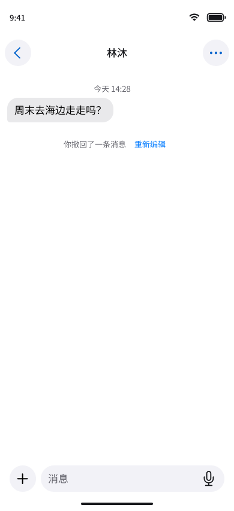
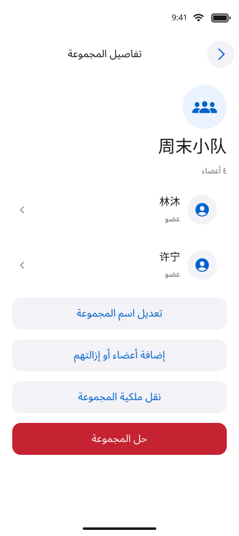
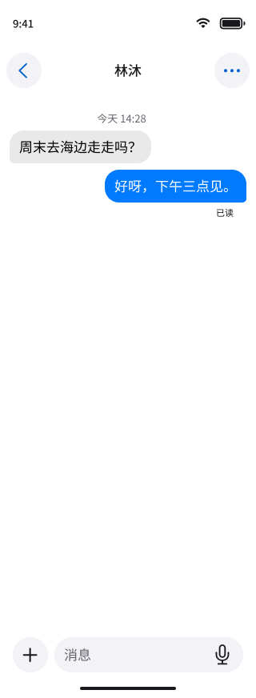
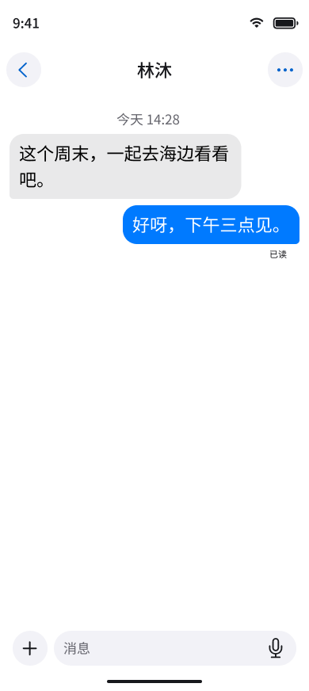

# 聊天 Figma 交接与验证

2026-09-28 新增：[好友通过双向聊天提醒、六个状态及四语言文案](friendship-notice.md)。

> 初版六页设计的历史记录。后续已新增通讯录与三标签，并按工程更新聊天样式；当前结果以 [工程对照](engineering-alignment.md) 和 [实施记录](contacts-implementation.md) 为准。下方初版统计不代表更新后的全量检查。

[打开设计导览](https://www.figma.com/design/su1BAcMKAwW11bE2n2n9rN?node-id=50-1805) · [打开流程入口](https://www.figma.com/proto/su1BAcMKAwW11bE2n2n9rN?node-id=50-1805&starting-point-node-id=50%3A1805) · [完整页面索引](state-index.md)

## 交付清单

后续撤回更新新增 `Chat/RevocationNotice` 组件及重新编辑流程，见 [撤回专项交接](revoke-reedit.md)。当前工程画廊包含 33 张设计图；下方六页统计为初版历史记录。

在原 AzureFish 文件中追加六页，未修改既有登录／个人中心业务页面。

| 新页面 | 内容 | 入口 |
| --- | --- | --- |
| 08 聊天流程 | 设计导览、原则及五条核心流程入口 | [打开](https://www.figma.com/design/su1BAcMKAwW11bE2n2n9rN?node-id=49-1805) |
| 09 聊天组件 | 10 组组件集、40 个状态变体 | [打开](https://www.figma.com/design/su1BAcMKAwW11bE2n2n9rN?node-id=49-1806) |
| 10 会话与消息 | 30 个页面状态 | [打开](https://www.figma.com/design/su1BAcMKAwW11bE2n2n9rN?node-id=49-1807) |
| 11 媒体 | 30 个页面状态 | [打开](https://www.figma.com/design/su1BAcMKAwW11bE2n2n9rN?node-id=49-1808) |
| 12 群管理 | 29 个页面状态 | [打开](https://www.figma.com/design/su1BAcMKAwW11bE2n2n9rN?node-id=49-1809) |
| 13 聊天适配与验收 | 20 个适配实例及规则说明板 | [打开](https://www.figma.com/design/su1BAcMKAwW11bE2n2n9rN?node-id=49-1810) |

合计 **89 个业务状态、20 个适配实例**。四语言文案表包含 **148 条**，以完整句子与具名占位参数交接；动态复数与格式化规则见 [copy.md](copy.md)。翻译不是运行时简繁转换。

复用既有三个变量集合（Primitives、Appearance、Metrics）、53 个变量和 24 个文字样式。没有创建第二套主题或字体系统。新增组件包括 Conversation、Bubble、Delivery、Receipt、Attachment、Transfer、Voice、Composer、Sync 和 Permission。基础按钮使用现有组件实例；容器使用 Auto Layout，文字可编辑，状态变体独立命名。

更新后的发送气泡使用 accent／onAccent，接收气泡使用 chatIncoming／text；状态通过文案与形状共同表达。图片为可编辑虚构风景插画，不引用用户照片；媒体色彩独立于深浅色，RTL 只调整附件顺序的布局，不反转图片内容。

未新增 Code Connect 或应用类型声明：本轮设计仅建立业务状态契约，后续 UIKit 实现按现有工程结构接入。Figma 字体沿用 SF Pro 与 Noto 中文／阿拉伯语设计替代，App 继续使用系统字体。

## 原型评审路径

| 流程 | 入口与路径 | 预设交互说明 |
| --- | --- | --- |
| 私聊 | [空列表](https://www.figma.com/proto/su1BAcMKAwW11bE2n2n9rN?node-id=53-1860&starting-point-node-id=53%3A1860) → 发起聊天 → 查询结果 → 开始聊天 → 发送 | 点击输入进入预填样例；发送后切换预设“已发送”；点击状态查看送达／已读样例 |
| 群管理 | [创建群聊](https://www.figma.com/proto/su1BAcMKAwW11bE2n2n9rN?node-id=55-1805&starting-point-node-id=55%3A1805) → 填写群名 → 创建 → 详情 → 管理 | 转让确认后进入普通成员视图；退出／解散进入只读历史 |
| 媒体 | [附件草稿](https://www.figma.com/proto/su1BAcMKAwW11bE2n2n9rN?node-id=54-1805&starting-point-node-id=54%3A1805) → 排序 → 发送 → 上传／处理／就绪 → 已发送 → 浏览／下载／保存 | 阶段自动切换仅演示结果；取消保留未提交草稿；不调用真实系统保存和分享 |
| 离线与对账 | [等待网络](https://www.figma.com/proto/su1BAcMKAwW11bE2n2n9rN?node-id=53-2313&starting-point-node-id=53%3A2313) → 点击离线提示 → 确认结果 → 已发送 | 点击提示模拟恢复网络，不代表真实 App 中需要手动点击才恢复 |
| 撤回 | [撤回确认](https://www.figma.com/proto/su1BAcMKAwW11bE2n2n9rN?node-id=53-2534&starting-point-node-id=53%3A2534) → 撤回占位；[媒体不可用](https://www.figma.com/proto/su1BAcMKAwW11bE2n2n9rN?node-id=54-2279&starting-point-node-id=54%3A2279) | 本人消息支持长按原型菜单；撤回后的媒体页不再显示原件预览 |

跨“会话／媒体／群管理”页面的流程通过明确的 Figma 原型 URL 衔接；各页面内部用同页 NAVIGATE 连线。89 个业务状态均提供独立原型起点，便于评审错误分支。适配稿用于静态比较，不模拟真实环境切换。

原型不执行真实文字输入、账号查询、权限、音视频播放、上传、下载、保存、网络刷新和全局状态恢复。系统接管页面以可编辑说明屏表达交接点。自动等待后进入完成状态**不构成时长或成功保证**。

## 初版静态验证结果（历史）

机器记录见 [validation.json](validation.json)。检查覆盖本轮新增内容，既有认证设计不计入本次验收。

| 检查 | 结果与证据 |
| --- | --- |
| 页面结构 | 通过：六个新增页面、89 个业务状态、20 个适配实例；每个状态具有稳定的设计身份和节点链接 |
| 可编辑性 | 通过：组件、文字、Auto Layout 容器和矢量样例；不是把完整页面压成图片 |
| 原型目标 | 通过：扫描 340 条页面内／跨页跳转，未发现失效目标；另有导览的五个入口链接 |
| 触控尺寸 | 通过：扫描已连接操作区域，未发现宽或高小于 44 pt 的目标；同步重试与麦克风区域已修正 |
| 文本边界 | 通过：未发现可见非图标文字越出直接父容器；不把此检查等同于真实 Dynamic Type 验收 |
| 代表颜色对比 | 通过：主操作／白字 5.80:1；危险操作／白字 5.76:1；浅色次级文字 5.33:1；深色次级文字 4.65:1。未宣称所有颜色组合已自动验证 |
| 渲染审阅 | 通过：列表、私聊、撤回占位、媒体草稿／处理、群主详情、深色、阿拉伯语、320 pt、大字体及 iPad 双栏代表稿 |
| 四语言表 | 通过：148 条记录四列齐全，无空翻译；母语专家审校未执行 |
| 本地文档 | 通过：相对链接、Markdown、109 个状态唯一性、148 条四语言记录、六张 PNG 签名及 `git diff --check`；新增未跟踪文档另以 `git diff --no-index --check` 检查 |
| 浏览器逐路径点击 | 未执行；连线结构检查与 Figma 渲染检查不能替代实际浏览器操作 |
| 应用编译／单元与组件测试 | 不适用：本轮无应用代码变更 |
| 模拟器／真机／真实服务联调 | 未执行 |
| VoiceOver／键盘／系统玻璃／首帧与窗口连续性 | 未执行运行验证；已提供设计规则与后续验收条件 |

修正记录：导览水平容器自适应高度；气泡宽度；宽屏输入组件伸展；消息状态轻量呈现；列表时间与未读对齐；只读群聊关闭附件入口；超限附件禁止提交；撤回移除正文／媒体；语音播放与发送分离；同步重试触控区域增至 44 pt。

## 本地预览

以下图片是本轮 Figma 渲染导出，便于离线查看，不能代替可编辑原稿。

| 会话列表 | 私聊 | 撤回 |
| --- | --- | --- |
|  |  |  |

| 阿拉伯语群管理 | 320 pt 窄屏 | 大字体 |
| --- | --- | --- |
|  |  |  |

## 后续实现验收

实现时分别验证：稳定消息身份与去重、持久 outbox、账号隔离、HTTP 同步及已读覆盖、断网／刷新／重新登录恢复、撤回后的旧事件与旧授权、群历史区间、媒体完整性及临时明文清理。旧系统完整聊天不能继续停留在占位页。

UI 运行矩阵包括 iOS 15～25 非玻璃、26+ Liquid Glass，Duo 按可用 SDK 检查；iPhone／iPad 窗口变化、浅深色、四语言、RTL、大字体、VoiceOver、降低透明度、增强对比度及硬件键盘。先保证数据与导航连续，再优化动画；真实账号与生产 HTTPS/WSS 不属于本轮证据。

## 全屏列表与空状态更新（2026-09-27）

移除假会话行和空页大按钮；新增 Chat/ListState 四状态组件及七张工程 PNG。原始导航和三标签保留。布局、同步基线、四语言文案与验收边界见 [专项交接](conversation-list-empty.md)。
