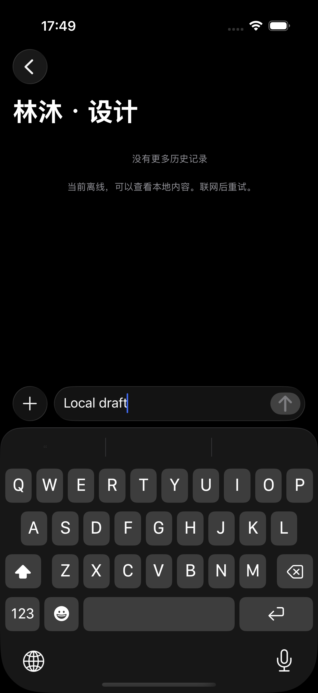
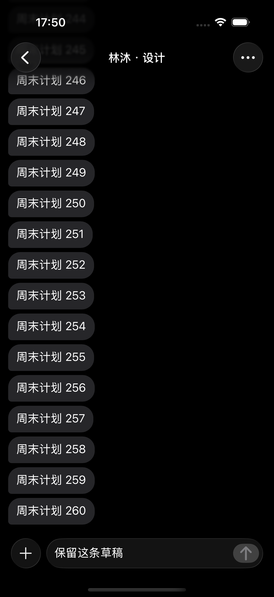

# 联系人本地打开聊天

2026-09-30 实现。好友详情的“发消息”仅执行本地导航，不等待网络解析。已有私聊优先复用当前快照或加密库中的会话；匹配条件是私聊类型以及双方成员 ID 完全一致，不把共同群聊当成私聊。聊天页继续沿用统一导航栈的 TabBar 规则。

没有本地私聊时直接打开空页，允许编辑和恢复草稿。空页不请求历史、不显示依赖权威会话 ID 的详情操作，也不把临时页面写入权威会话表。用户第一次实际发送时才调用已有 resolve 接口；解析失败保留输入，重试复用操作 ID。解析成功且消息进入本地发送队列后才清除编辑器输入；服务端消息送达仍遵循原有队列流程。

## 本地身份和草稿生命周期

临时页面标识为 `local-direct:<peerID>`，只在当前环境、账号的加密库内有效，不是服务端会话 ID。复用现有 meta 表保存以下元数据：

| 键 | 含义 |
| --- | --- |
| `direct.pending:<localID>` | 尚未完成权威会话绑定的页面 |
| `direct.operation:<localID>` | 首次发送解析的稳定 UUID，重试和多窗口复用 |
| `direct.binding:<localID>` | 草稿迁移后的权威会话 ID |

首次发送先检查本地是否已同步到对应私聊，否则请求服务端。权威会话保存、文字／富文本／附件清单迁移和绑定记录在同一个 SQLCipher 事务内完成；两边都有非空草稿时事务失败，保留双方输入。旧页面迟到的草稿保存和读取按绑定记录转到权威会话，富文本清单的 owner 同步更新。读取重定向、富文本、旧版草稿及附件使用同一数据库快照。媒体继续使用原有 AES-GCM 存储，不另建明文缓存。

退出、账号切换仍遵守现有 engine 身份检查和存储关闭流程。本次未修改服务端、Protobuf 或用户文案。空聊天草稿可从同一好友入口重新打开；不生成虚假的权威会话列表记录。冷启动仍停留在会话列表。

## 本次验证

环境：Xcode 26.5、iOS 26.5、iPhone 17 Pro 模拟器，x86_64 架构。UI 使用隔离的虚构联系人、会话及草稿；首次发送组件测试使用内存 HTTPTransport，不向真实账号发送消息。

- 编译：应用及测试目标通过。
- 正常启动：安装本机签名构建后复核通过，保留原账号本地数据，当前模拟器停留在聊天标签的会话列表，未自动打开详情。
- 静态检查：文档链接与 `git diff --check` 通过，依赖锁文件无变更。
- 模拟器 UI：2 项通过，覆盖离线打开已有私聊、重复进入同一会话、无历史打开空页、编辑和返回后恢复草稿、非根页面隐藏 TabBar。
- 人工视觉：检查本轮 XCTest 原始截图，空页输入栏位于键盘上方，已有会话输入栏位于安全区内，无 TabBar 残留或额外底部占位。
- 单元／组件：最终 22 项通过（4 个 suite），覆盖本地查找、空页不解析、首次发送失败保留、自动与手动重试复用操作 ID、绑定迁移、双草稿冲突、迟到保存、草稿原有行为及导航／启动。首轮 1 项因假设 HTTPTransport 仅调用一次失败；依据已有幂等自动重试修正断言后复跑通过。
- 旧系统与 iOS 27.1 Duo：被环境阻塞，仅安装 iOS 26.5。该变更的 iPad UI、真机、真实服务联调、四语言及完整辅助功能矩阵未执行。统一导航的 iPad 折叠／展开结果见[导航验证](../Validation/navigation-2026-09-30/README.md)，不替代本次好友跳转专项验证。

最终组件结果：`/tmp/AzureFish-local-chat-components.xcresult`。

UI 结果：`/tmp/AzureFish-local-chat-final.xcresult`（两项 UI 通过，包含上述首轮组件断言失败）。来源：[组件测试](../../../AzureFishTests/Chat/ChatDirectConversationTests.swift)、[UI 测试](../../../AzureFishUITests/Account/AppNavigationUITests.swift)。

| 无历史空聊天与草稿 | 离线打开已有聊天 |
| --- | --- |
|  |  |
