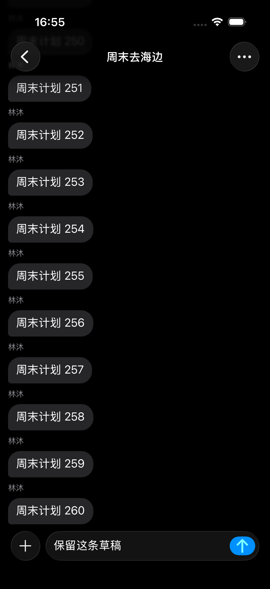
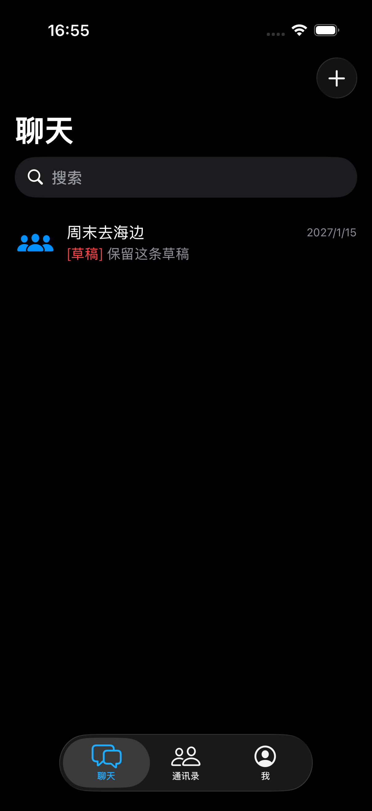
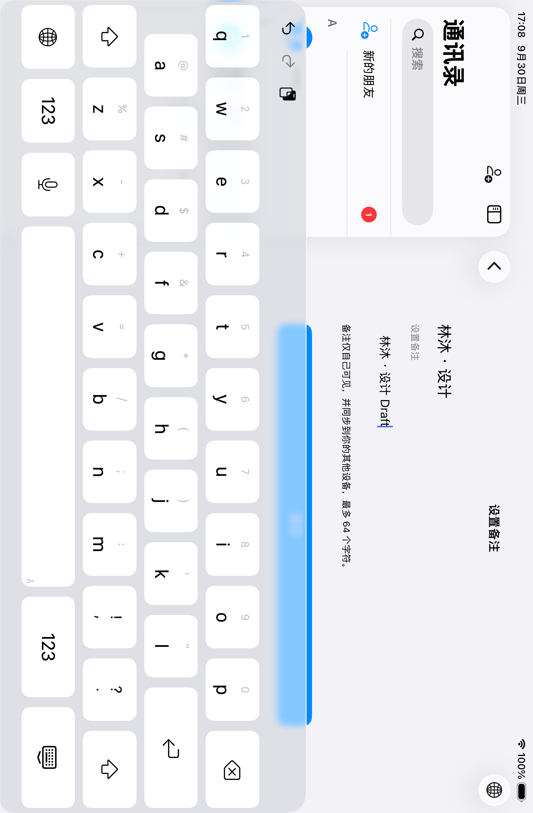
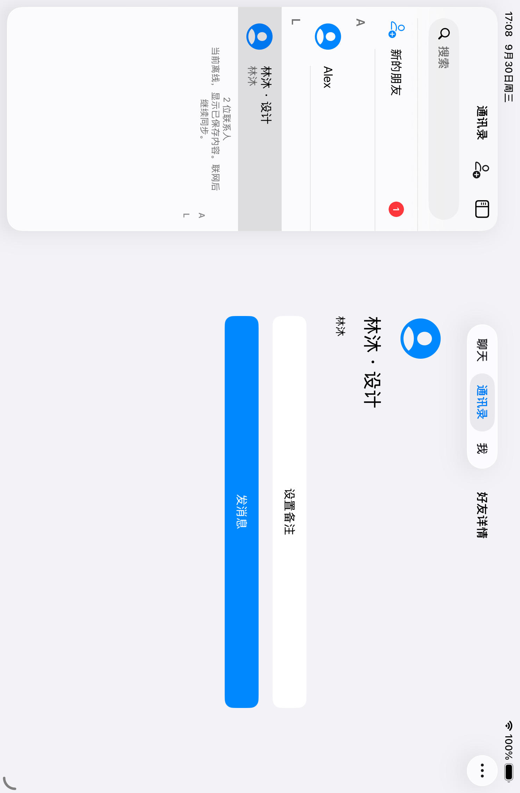
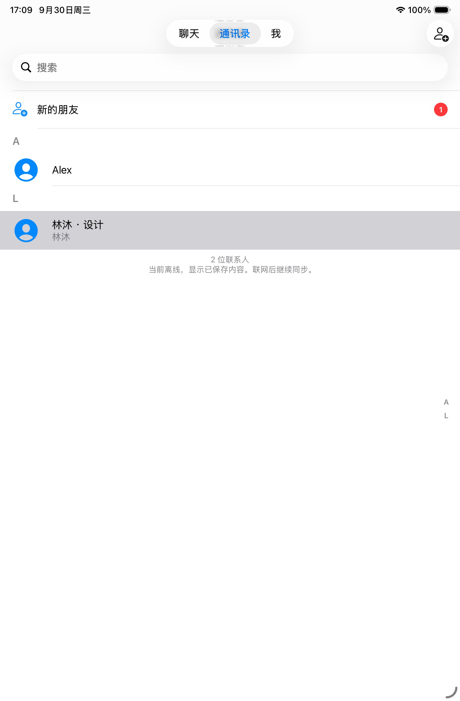

# 导航栈与启动会话列表验证

日期：2026-09-30。环境：Xcode 26.5（17F42）、iOS 26.5 模拟器。隔离 UI 回归使用虚构数据，不启动网络同步。

## 实现规则

[AppNavigationController](../../../../AzureFish/App/AppNavigationController.swift) 统一设置根页与非根页的 `hidesBottomBarWhenPushed`，覆盖初始化、push、`setViewControllers` 和直接赋值。运行入口、模态导航、Debug 入口及预览均使用同一容器。

iOS 18 起额外调用系统 `setTabBarHidden(_:animated:)`，处理分栏嵌套中仅设置页面标记不足以隐藏 TabBar 的情况。当前 Tab 中可见的内外层导航栈均参与判定，任一栈顶不是第一个控制器就隐藏。窄屏中详情导航容器压入主栈后隐藏，返回列表恢复；宽屏两列均回到根位置后显示。侧滑取消按最终页面恢复，不直接修改 `tabBar.isHidden`。

新建已登录主界面停留在聊天 Tab 的会话列表，忽略旧 `selectedTab`、`selectedConversation`，不清理账号内容。手动打开会话后，回到前台或旋转窗口保留该页面。

本轮规则已按用户最新要求调整：不再排除分栏折叠后的外层导航栈。此前“窄屏详情根页显示”的测试与截图不能作为当前规则的证据。

## 本轮验证

| 验证项 | 结果 | 覆盖范围 |
| --- | --- | --- |
| 编译 | 通过 | 应用及测试目标，x86_64 模拟器架构，最低部署版本仍为 iOS 15 |
| 单元／组件 | 通过 | 9 项：7 项导航测试、2 项启动测试；替换栈另覆盖有／无动画参数 |
| iPhone UI | 通过 | 5 项：三个 Tab 的 push/pop、内外层侧滑取消与完成、冷启动与前后台切换、原有通讯录黑名单导航；iPad 旋转用例在 iPhone 条件跳过 |
| iPad UI | 通过 | 1 项：折叠／展开及再次折叠，未提交输入保留，展开根页显示、折叠详情隐藏、返回列表恢复 |
| 视觉检查 | 通过 | 检查下列原始 XCTest 截图：iPhone 深色聊天详情无 TabBar 残留，输入栏位置正常；列表恢复 TabBar；iPad 浅色分栏与输入状态正确 |
| 静态检查 | 通过 | 文档链接、`git diff --check`；业务页无独立显隐赋值，依赖锁文件无变更 |

结果包：`/tmp/AzureFish-stack-startup-iPhone.xcresult`、`/tmp/AzureFish-stack-startup-iPad.xcresult`。正常入口启动复核通过：带本机签名的 Debug 构建保留原有本地会话，启动停留在聊天列表（离线状态），未自动打开详情。模拟器最终停留在列表。未签名测试构建启动正常账号入口时曾因本机资料读取失败进入恢复页；使用 `CODE_SIGNING_ALLOWED=YES CODE_SIGN_IDENTITY=-` 构建并安装后恢复，未清空账号或本地数据。

测试来源：[导航组件测试](../../../../AzureFishTests/Account/AppNavigationControllerTests.swift)、[启动组件测试](../../../../AzureFishTests/Chat/ChatStartupTests.swift)、[导航 UI 测试](../../../../AzureFishUITests/Account/AppNavigationUITests.swift)。UI 入口为 `-chat-details-ui-test -navigation-tabs`；附加 `-navigation-stored-conversation` 模拟旧选择键并在页面加载后发布快照。

仅安装 iOS 26.5 运行时；iOS 15～25、iOS 27.1 Duo 被环境阻塞。真机、四语言与完整辅助功能矩阵未执行，真实服务联调不适用。

## 截图

原始截图从本轮通过的 XCTest 结果直接导出，未修改画面。

| 聊天详情隐藏 TabBar | 返回会话列表恢复 TabBar |
| --- | --- |
|  |  |

